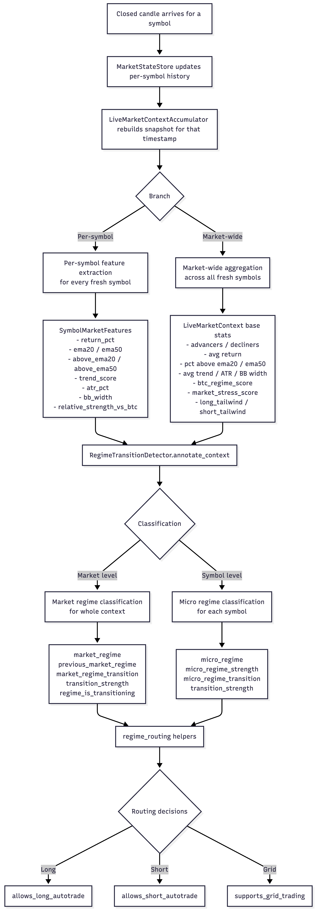

# Market Regime Overview

This module builds a market-wide context snapshot, classifies both the overall market and each individual symbol, and then annotates transitions between snapshots so strategies can react to changing conditions instead of only point-in-time scores.

The system has four layers:

1. Snapshot assembly
2. Feature extraction
3. Regime classification
4. Transition-aware routing


## Snapshot Layer

`LiveMarketContextAccumulator` rebuilds a timestamp-level market snapshot incrementally as closed candles arrive.

Important properties:

- A context is only emitted when enough symbols are fresh for the exact timestamp
- BTC is treated as the anchor symbol for relative-strength comparisons
- Each new context is compared to the most recent prior context to annotate transitions

The output is a `LiveMarketContext` object containing aggregate market statistics and a `symbol_features` map keyed by symbol.

## Feature Layer

Each fresh symbol is converted into `SymbolMarketFeatures`, including:

- `return_pct`
- `ema20`
- `ema50`
- `above_ema20`
- `above_ema50`
- `trend_score`
- `atr_pct`
- `bb_width`
- `relative_strength_vs_btc`

At the same time, the market snapshot computes aggregate context metrics such as:

- advancers and decliners
- advancers and decliners ratios
- average return
- average relative strength versus BTC
- percent above EMA20 and EMA50
- average trend score
- average ATR percent
- average Bollinger Band width
- `btc_regime_score`
- `market_stress_score`
- `long_tailwind`
- `short_tailwind`

These are the raw ingredients used by the regime classifier.

## Market Regime

The market-level classifier assigns one `MarketRegime` to the entire snapshot:

- `TREND_UP`
- `TREND_DOWN`
- `RANGE`
- `HIGH_STRESS`
- `TRANSITIONAL`

The detector computes four competing scores:

- `long_score`
- `short_score`
- `range_score`
- `stress_score`

These are built from market-wide breadth, trend participation, BTC alignment, and stress.

Decision order:

```text
if stress_score is strong enough -> HIGH_STRESS
else if long_score wins clearly   -> TREND_UP
else if short_score wins clearly  -> TREND_DOWN
else if range_score is high       -> RANGE
else                              -> TRANSITIONAL
```

`TRANSITIONAL` is the fallback when no directional or range regime has enough edge to be trusted.

## Micro Regime

The symbol-level classifier assigns one `MicroRegime` per symbol:

- `TREND_UP`
- `TREND_DOWN`
- `RANGE`
- `VOLATILE`
- `TRANSITIONAL`

The detector computes four competing symbol scores:

- `up_score`
- `down_score`
- `range_score`
- `volatile_score`

These are based on the symbol's own trend, EMA alignment, ATR, Bollinger width, and relative strength versus BTC.

Decision order:

```text
if volatility is strong enough    -> VOLATILE
else if up_score wins clearly     -> TREND_UP
else if down_score wins clearly   -> TREND_DOWN
else if range_score is high       -> RANGE
else                              -> TRANSITIONAL
```

Important distinction:

- `HIGH_STRESS` is a market-wide condition
- `VOLATILE` is a symbol-specific condition

## Transition Layer

The transition layer compares the current snapshot to the previous snapshot and records both the event and the transition strength.

### Market transition fields

- `market_regime`
- `previous_market_regime`
- `market_regime_transition`
- `market_regime_transition_strength`
- `regime_is_transitioning`

Market transition events:

- `STRESS_SPIKE`
- `STRESS_RELIEF`
- `ENTERED_TREND_UP`
- `ENTERED_TREND_DOWN`
- `ENTERED_RANGE`
- `LOST_REGIME_EDGE`

### Symbol transition fields

- `micro_regime`
- `micro_regime_strength`
- `micro_regime_transition`
- `micro_regime_transition_strength`

Micro transition events:

- `VOLATILITY_EXPANSION`
- `BREAKOUT_UP`
- `BREAKDOWN`
- `RECOVERY`
- `MEAN_REVERSION`
- `ENTERED_TREND_UP`
- `ENTERED_TREND_DOWN`
- `ENTERED_RANGE`
- `ENTERED_TRANSITIONAL`

## Transitional vs Transitioning

`TRANSITIONAL` and `regime_is_transitioning` are related but intentionally not identical.

- `TRANSITIONAL` means the classifier could not find a clear dominant market regime
- `regime_is_transitioning` means the current market snapshot should be treated as unstable for trading decisions

In practice:

- `regime_is_transitioning` is `True` whenever the market regime is `TRANSITIONAL`
- it can also be `True` during a sufficiently strong change between two non-transitional regimes

That makes `regime_is_transitioning` the stronger operational safety flag.

## Routing Layer

Strategies should not consume the raw regime labels directly unless they have a very specific reason to do so. The normal entry point is `regime_routing.py`, which exposes:

- `resolve_symbol_features(...)`
- `allows_long_autotrade(...)`
- `allows_short_autotrade(...)`
- `supports_grid_trading(...)`

These helpers combine:

- market regime
- market stress
- symbol micro regime
- symbol transition events
- the top-level `regime_is_transitioning` safety flag

Current routing policy:

```text
if context.regime_is_transitioning:
    return False
```

This means strategies are paused not only when the market is explicitly `TRANSITIONAL`, but also during strong regime handoffs that have not stabilized yet.

## Practical Mental Model

Use this shorthand when reasoning about the system:

- `market_regime` answers: "What is the broad environment?"
- `micro_regime` answers: "What is this symbol doing inside that environment?"
- transition fields answer: "Is the environment changing fast enough that we should hesitate?"
- routing answers: "Given all of the above, should this strategy be allowed to act?"
